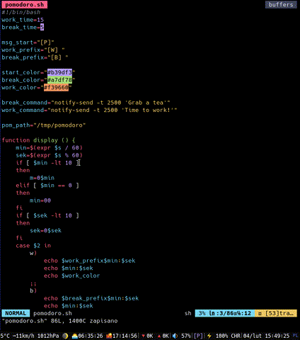

# i3blocks-pomodoro

Simple yet customizable timer for i3blocks to keep you from being distracted and actually focus.
[Pomodoro technique](https://en.wikipedia.org/wiki/Pomodoro_Technique)

Edit config variables and add those lines to your i3blocks config
```ini
[pomodoro]
command=<path to pomodoro.sh>
interval=1
```


